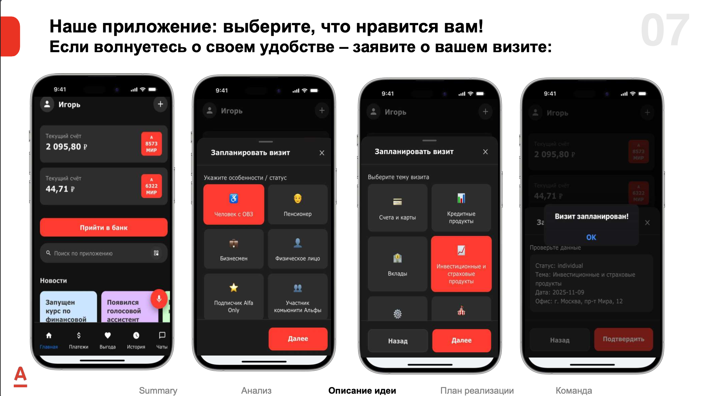
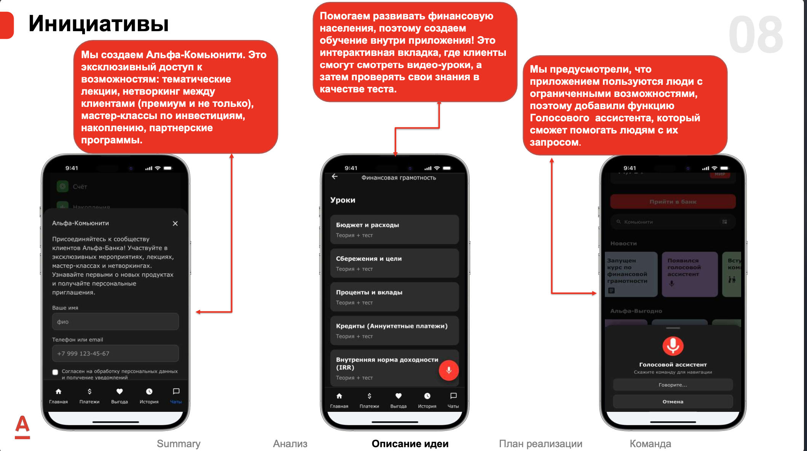
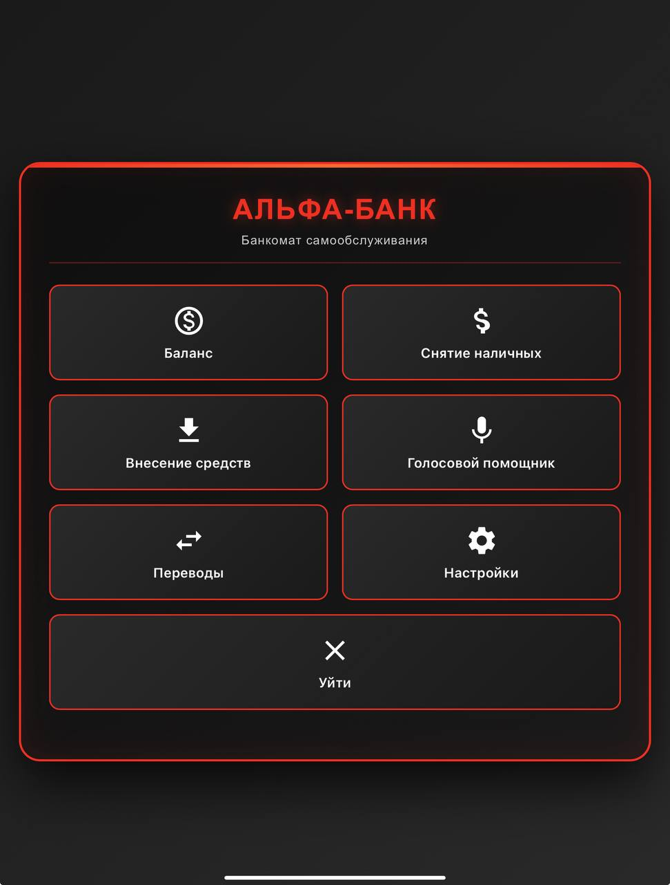
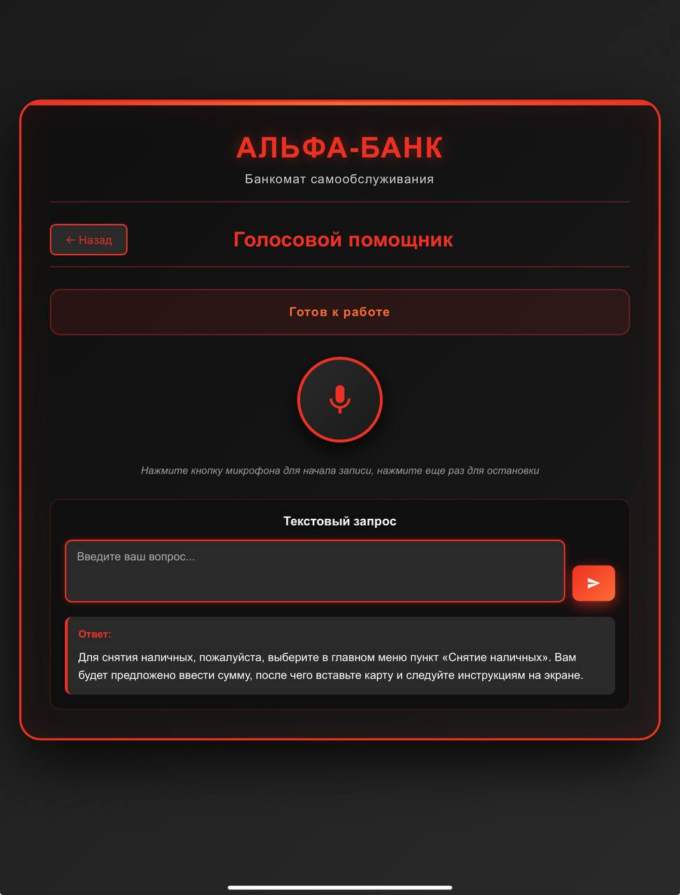
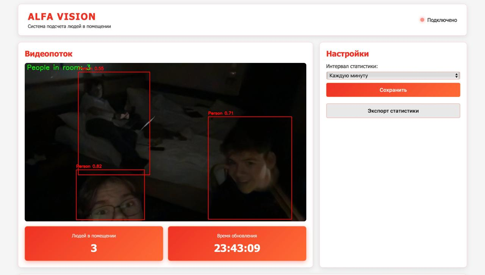

# Проект Альфа-Банка: Интеллектуальные банковские решения

Комплексный проект, включающий мобильное приложение Альфа-Банка, интерактивный банкомат с голосовым помощником и систему мониторинга посещаемости помещений на основе компьютерного зрения.

## 📋 Содержание

- [Обзор проекта](#обзор-проекта)
- [Мобильное приложение Альфа-Банка](#мобильное-приложение-альфа-банка)
- [Банкомат с голосовым помощником](#банкомат-с-голосовым-помощником)
- [Alfa Vision - Система детекции людей](#alfa-vision---система-детекции-людей)
- [Установка и настройка](#установка-и-настройка)
- [Запуск проектов](#запуск-проектов)
- [Технологии](#технологии)
- [API Документация](#api-документация)

---

## 🎯 Обзор проекта

Проект состоит из трех основных компонентов:

1. **Мобильное приложение Альфа-Банка** - веб-приложение с функциями планирования визитов, финансовой грамотности и голосового помощника
2. **Интерактивный банкомат** - веб-приложение, имитирующее интерфейс банкомата Альфа-Банка с интегрированным голосовым помощником на базе GigaChat и Salute Speech
3. **Alfa Vision** - система мониторинга и подсчета людей в помещении с использованием YOLO и компьютерного зрения

---

## 📱 Мобильное приложение Альфа-Банка

**Расположение:** `app/`

Веб-приложение, имитирующее мобильное приложение Альфа-Банка с расширенным функционалом для клиентов.




#### Основные возможности:

- 📅 **Планирование визитов:**
  - Заявка на визит в отделение банка
  - Выбор статуса клиента (ОВЗ, пенсионер, бизнесмен и др.)
  - Выбор темы визита (счета, кредиты, вклады, инвестиции)
  - Подтверждение и планирование визита

- 📚 **Финансовая грамотность:**
  - Интерактивные уроки по финансовой грамотности
  - Видео-уроки и тесты
  - Темы: бюджет, сбережения, кредиты, вклады, инвестиции
  - Проверка знаний после каждого урока

- 👥 **Альфа-Комьюнити:**
  - Эксклюзивное сообщество клиентов Альфа-Банка
  - Тематические лекции и мастер-классы
  - Нетворкинг между клиентами
  - Партнерские программы
  - Персональные приглашения на мероприятия

- 🎤 **Голосовой помощник:**
  - Навигация по приложению голосом
  - Помощь людям с ограниченными возможностями
  - Голосовые команды для управления

#### Структура:

```
app/
├── index.html              # Главная страница приложения
├── index.js                # JavaScript логика
├── index.css               # Стили
├── fingram.html            # Страница финансовой грамотности
├── vigoda.html             # Страница планирования визитов
├── chats.html              # Страница чатов
├── history.html            # История операций
├── platezi.html            # Платежи
├── plus.html               # Дополнительные услуги
└── financial-literacy-course.json  # Данные курса
```

#### Особенности интерфейса:

- Темная тема в стиле Альфа-Банка
- Адаптивный дизайн для мобильных устройств
- Интуитивная навигация
- Красные акценты бренда Альфа-Банка

---

## 🏦 Банкомат с голосовым помощником

**Расположение:** `bankomat/`

Интерактивный банкомат с полным функционалом самообслуживания и интеллектуальным голосовым помощником.




**Расположение:** `bankomat/`

Интерактивный банкомат с полным функционалом самообслуживания и интеллектуальным голосовым помощником.

#### Основные возможности:

- 🏦 **Банковские операции:**
  - Проверка баланса счета
  - Снятие наличных
  - Внесение средств
  - Переводы между счетами
  - Настройки системы

- 🎤 **Голосовой помощник:**
  - Распознавание речи (Speech-to-Text) через Salute Speech API
  - Обработка запросов через GigaChat AI
  - Синтез речи (Text-to-Speech) через Salute Speech API
  - Полный цикл: голос → текст → ИИ → ответ → голос
  - Текстовый чат с ассистентом
  - Роль банкомата, консультанта и менеджера

- 💬 **Интеллектуальный ассистент:**
  - Отвечает на вопросы о банковских продуктах
  - Консультирует по условиям кредитования
  - Помогает выбрать подходящие услуги
  - Направляет к функциям интерфейса
  - Работает как банкомат, консультант и менеджер одновременно

#### Структура:

```
bankomat/
├── backend/
│   └── app.py          # Flask сервер с API для голосового помощника
├── frontend/
│   ├── index.html      # Главный интерфейс банкомата
│   ├── script.js       # JavaScript логика
│   └── style.css       # Стили в стиле Альфа-Банка
```

#### API Endpoints:

- `GET /` - Главная страница банкомата
- `POST /api/transcribe` - Распознавание речи
- `POST /api/chat` - Текстовый чат с ассистентом
- `POST /api/synthesize` - Синтез речи
- `POST /api/voice-assistant` - Полный цикл обработки (STT → AI → TTS)

#### Запуск:

```bash
cd bankomat/backend
python app.py
```

Сервер запустится на `http://localhost:8080`

---

## 👁️ Alfa Vision - Система детекции людей

**Расположение:** `ai/`

Система мониторинга и подсчета людей в помещении в реальном времени с использованием YOLO и компьютерного зрения.



#### Основные возможности:

- 👥 **Детекция людей:**
  - Обнаружение только людей (класс "person" из COCO dataset)
  - Обводка обнаруженных людей красным цветом
  - Подсчет количества людей в реальном времени

- 📊 **Статистика и мониторинг:**
  - Сбор статистики с настраиваемым интервалом (1 минута / 1 час)
  - Визуализация на графике (Chart.js)
  - Таблица истории изменений
  - Экспорт статистики в JSON

- 📹 **Видеопоток:**
  - Трансляция видео с камеры в браузер (MJPEG)
  - Обработка в реальном времени
  - Отображение текущего количества людей

#### Интерфейс:

Светлый интерфейс в стиле Альфа-Банка с красными акцентами, графиками и таблицами статистики.

#### Структура:

```
ai/
├── app.py              # Flask сервер для стриминга и API
├── main.py            # Утилиты для обработки видео/изображений
├── yolov8l.pt        # Модель YOLO для детекции объектов
├── static/
│   ├── index.html    # Веб-интерфейс Alfa Vision
│   ├── style.css     # Стили в стиле Альфа-Банка
│   └── script.js     # JavaScript логика
└── README.md         # Документация Alfa Vision
```

#### API Endpoints:

- `GET /` - Главная страница Alfa Vision
- `GET /video_feed` - Видеопоток (MJPEG)
- `GET /api/statistics` - Текущая статистика
- `GET /api/history` - История статистики
- `GET /api/settings` - Получить настройки
- `POST /api/settings` - Сохранить настройки (интервал сбора)
- `GET /api/export` - Экспорт статистики в JSON

#### Запуск:

```bash
cd ai
python app.py
```

Сервер запустится на `http://localhost:5001`

**Требования:**
- Веб-камера или USB-камера
- Модель YOLO (`yolov8l.pt`) должна находиться в папке `ai/`

---

## 🚀 Установка и настройка

### Предварительные требования

- Python 3.8+
- pip
- Веб-камера (для Alfa Vision)
- API ключи для GigaChat и Salute Speech (для банкомата)

### Установка зависимостей

```bash
pip install -r requirements.txt
```

### Настройка API ключей

1. Создайте файл `.env` в корне проекта:
```bash
cp env.example .env
```

2. Заполните `.env` файл:
```env
GIGACHAT_AUTH_KEY=your_gigachat_auth_key_here
SALUTE_SPEECH_AUTH_KEY=your_salute_speech_auth_key_here
```

### Установка модели YOLO

Для работы Alfa Vision необходимо скачать модель YOLO:

1. Модель `yolov8l.pt` должна находиться в папке `ai/`
2. Модель автоматически загрузится при первом запуске (если используется ultralytics)

---

## ▶️ Запуск проектов

### Мобильное приложение

Откройте файл `app/index.html` в браузере или используйте локальный веб-сервер:

```bash
cd app
python -m http.server 8000
```

Откройте браузер: `http://localhost:8000`

### Банкомат с голосовым помощником

```bash
cd bankomat/backend
python app.py
```

Откройте браузер: `http://localhost:8080`

### Alfa Vision

```bash
cd ai
python app.py
```

Откройте браузер: `http://localhost:5001`

### Быстрый запуск банкомата (через скрипт)

```bash
./run.sh
```

---

## 🛠 Технологии

### Backend

- **Flask** - веб-фреймворк для Python
- **Flask-CORS** - обработка CORS запросов
- **requests** - HTTP клиент для работы с API
- **python-dotenv** - загрузка переменных окружения
- **OpenCV** - обработка видео и изображений
- **Ultralytics YOLO** - детекция объектов

### Frontend

- **HTML5/CSS3** - структура и стилизация
- **JavaScript (ES6+)** - интерактивность
- **Chart.js** - визуализация графиков
- **Web Audio API** - запись аудио (для банкомата)
- **MediaRecorder API** - запись аудио

### AI/ML

- **YOLOv8** - модель детекции объектов
- **GigaChat** - языковая модель для обработки запросов
- **Salute Speech** - распознавание и синтез речи

### API Интеграции

- **GigaChat API** - обработка естественного языка
- **Salute Speech API** - STT и TTS

---

## 📚 API Документация

### Банкомат API

#### `POST /api/voice-assistant`
Полный цикл обработки голосового запроса.

**Request:**
- `audio`: файл аудио (multipart/form-data)

**Response:**
```json
{
  "audio": "base64_encoded_audio",
  "text": "распознанный текст",
  "reply": "ответ ассистента"
}
```

#### `POST /api/chat`
Текстовый чат с ассистентом.

**Request:**
```json
{
  "message": "ваш вопрос"
}
```

**Response:**
```json
{
  "reply": "ответ ассистента"
}
```

### Alfa Vision API

#### `GET /api/statistics`
Получить текущую статистику.

**Response:**
```json
{
  "current_count": 5,
  "timestamp": "2024-01-01T12:00:00",
  "interval": 60
}
```

#### `GET /api/history`
Получить историю статистики.

**Response:**
```json
{
  "statistics": [
    {
      "timestamp": "2024-01-01T12:00:00",
      "people_count": 5,
      "interval": 60
    }
  ],
  "total_records": 100
}
```

---

## 📁 Структура проекта

```
Gelya_crutaya/
├── app/                   # Мобильное приложение Альфа-Банка
│   ├── index.html        # Главная страница
│   ├── index.js          # JavaScript логика
│   ├── index.css         # Стили
│   ├── fingram.html      # Финансовая грамотность
│   ├── vigoda.html       # Планирование визитов
│   ├── chats.html        # Чаты
│   └── ...               # Другие страницы
├── bankomat/              # Банкомат с голосовым помощником
│   ├── backend/
│   │   └── app.py        # Flask сервер
│   └── frontend/
│       ├── index.html    # Интерфейс банкомата
│       ├── script.js     # JavaScript
│       └── style.css     # Стили
├── ai/                    # Alfa Vision
│   ├── app.py            # Flask сервер для стриминга
│   ├── main.py           # Утилиты обработки видео
│   ├── yolov8l.pt       # Модель YOLO
│   └── static/           # Веб-интерфейс
├── key/                   # Данные и модели
├── readme_img/           # Изображения для README
├── requirements.txt      # Python зависимости
├── env.example           # Пример конфигурации
├── run.sh                # Скрипт запуска
└── README.md             # Документация
```

---

## 🔧 Настройка и конфигурация

### Порт серверов

- **Банкомат:** `http://localhost:8080` (настраивается в `bankomat/backend/app.py`)
- **Alfa Vision:** `http://localhost:5001` (настраивается в `ai/app.py`)

### Интервал статистики Alfa Vision

По умолчанию: 60 секунд (1 минута)
Можно изменить через веб-интерфейс или API:
- 60 секунд - каждую минуту
- 3600 секунд - каждый час

---

## 📝 Примечания

- Для работы банкомата требуется стабильное интернет-соединение (API Sberbank)
- Для работы Alfa Vision требуется веб-камера
- Статистика Alfa Vision хранится в памяти (последние 1000 записей)
- Модель YOLO автоматически загружается при первом запуске

---

## 👥 Авторы

Проект разработан для Альфа-Банка командой Впорыве

---

## 📄 Лицензия

Проект создан в образовательных целях.

---

## 🤝 Поддержка

При возникновении проблем:
1. Проверьте наличие всех зависимостей
2. Убедитесь, что API ключи правильно настроены
3. Проверьте доступность камеры (для Alfa Vision)
4. Проверьте логи сервера
